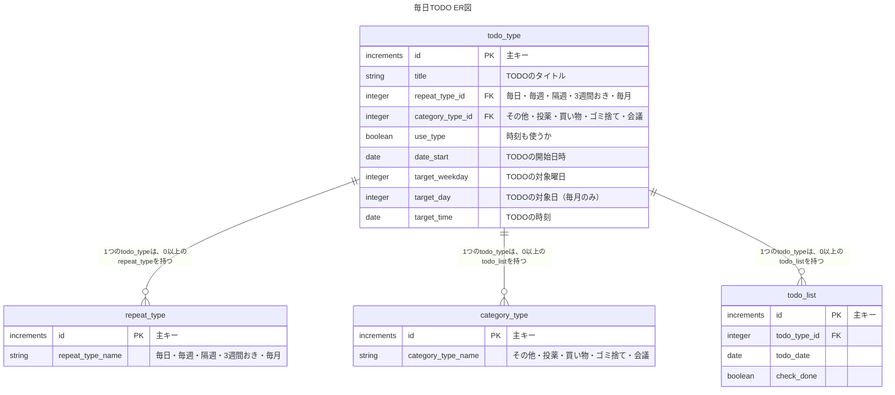

```mermaid
---
title: "毎日TODO ER図"
---
erDiagram
repeat_type {
    increments id PK "主キー"
    string repeat_type_name "毎日・毎週・隔週・3週間おき・毎月"
}

category_type {
    increments id PK "主キー"
    string category_type_name "その他・投薬・買い物・ゴミ捨て・会議"
}

todo_type {
    increments id PK "主キー"
    string title "TODOのタイトル"
    integer repeat_type_id FK "毎日・毎週・隔週・3週間おき・毎月"
    integer category_type_id FK "その他・投薬・買い物・ゴミ捨て・会議"
    boolean use_type "時刻も使うか"
    date date_start "TODOの開始日時"
    integer target_weekday "TODOの対象曜日"
    integer target_day "TODOの対象日（毎月のみ）"
    date target_time "TODOの時刻"
}

todo_list {
    increments id PK "主キー"
    integer todo_type_id FK
    date todo_date
    boolean check_done
}

todo_type ||--o{ repeat_type : "1つのtodo_typeは、0以上のrepeat_typeを持つ"
todo_type ||--o{ category_type : "1つのtodo_typeは、0以上のtodo_listを持つ"
todo_type ||--o{ todo_list : "1つのtodo_typeは、0以上のtodo_listを持つ"
```
